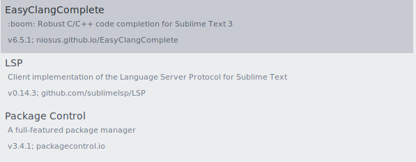

## Sublime Text setup for competitve programming.
	
    
    1.Install Sublime text. 
	2.Install g++ compiler.
	3.Install clangd,llvm,LSP(for autocomplete in sublime text)
	4.Setup sublime themes(personal preferance)
	5.Install Following Packages 
        
   

    Optional : Enable Vintage Plugin(adds vim support to sublime.)

[Main Docs](README.md)